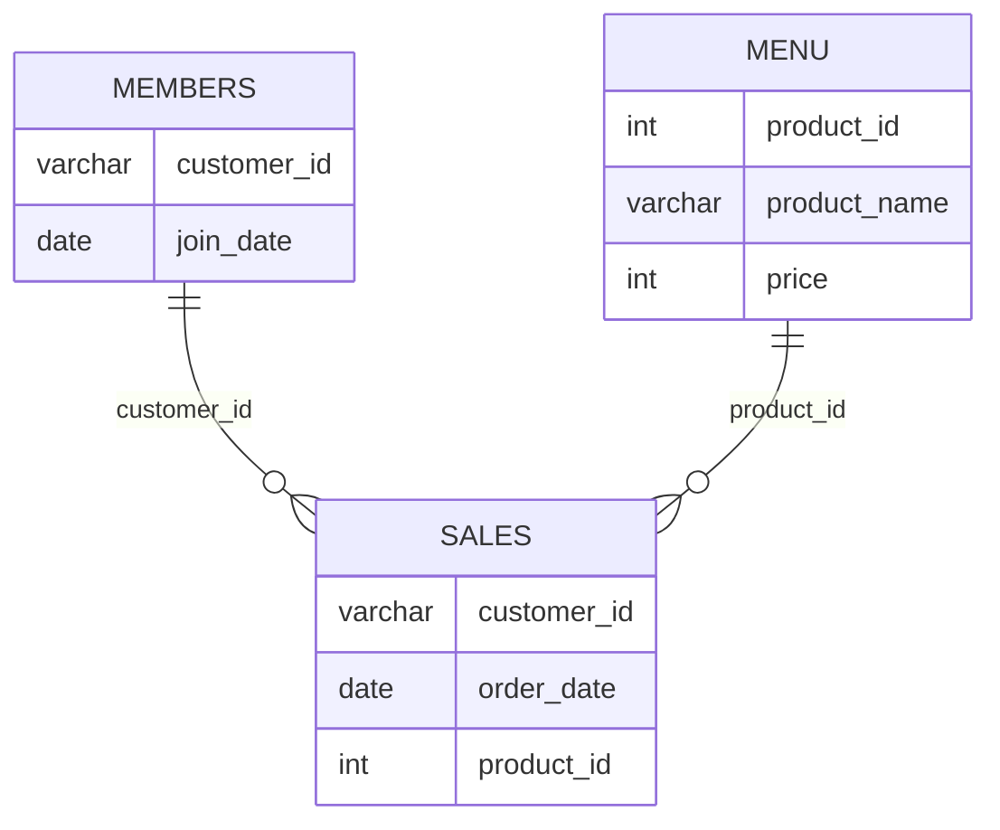

# Case Study #1: Danny's Diner

📎 [Official case study page](https://8weeksqlchallenge.com/case-study-1/)
**Status:** 🔴 Not started

## Problem

_In 2–3 sentences, in your own words: who is Danny, what does he want to know, and why?_

## Entity Relationship Diagram



> Customer C is in `sales` but not in `members`. Watch out for that when joining.

## Questions & Solutions

_For each question: paste your query, the result, and 1–2 lines on how you approached it.
See the official page for the exact wording of each question._

### Q1. Total amount each customer spent

```sql
-- your query here
```

**Result:**

| | |
|-|-|
| | |

**Approach:**

### Q2. Number of days each customer visited

```sql
-- your query here
```

**Result:**

| | |
|-|-|
| | |

**Approach:**

### Q3. First item each customer purchased

```sql
-- your query here
```

**Result:**

| | |
|-|-|
| | |

**Approach:**

### Q4. Most purchased item overall, and how many times

```sql
-- your query here
```

**Result:**

| | |
|-|-|
| | |

**Approach:**

### Q5. Most popular item for each customer

```sql
-- your query here
```

**Result:**

| | |
|-|-|
| | |

**Approach:**

### Q6. First item purchased after becoming a member

```sql
-- your query here
```

**Result:**

| | |
|-|-|
| | |

**Approach:**

### Q7. Item purchased just before becoming a member

```sql
-- your query here
```

**Result:**

| | |
|-|-|
| | |

**Approach:**

### Q8. Total items and amount spent per member before joining

```sql
-- your query here
```

**Result:**

| | |
|-|-|
| | |

**Approach:**

### Q9. Points per customer ($1 = 10 pts, sushi = 2x)

```sql
-- your query here
```

**Result:**

| | |
|-|-|
| | |

**Approach:**

### Q10. Points for A and B at end of January, with the first-week 2x promo

```sql
-- your query here
```

**Result:**

| | |
|-|-|
| | |

**Approach:**

## Bonus Questions

### Join All The Things

```sql
-- your query here
```

### Rank All The Things

```sql
-- your query here
```

## What tripped me up

- 

## SQL concepts I used

- 
